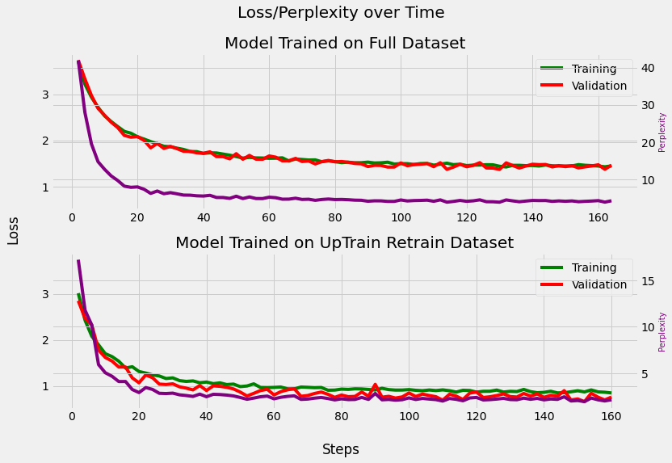
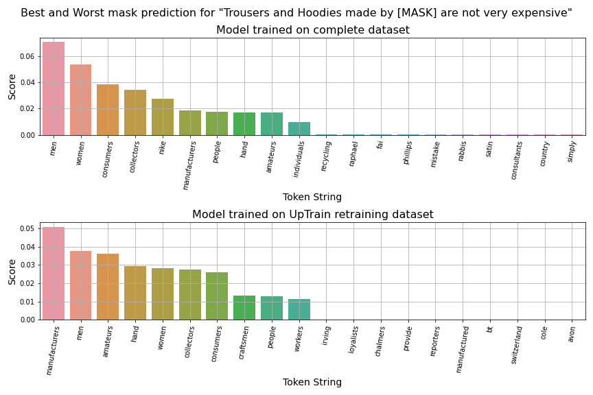

# mlm-product-customer-support-team

Masked Language Modelling for Product and Customer Support Teams at Nike using distilbert-base-uncased. Submission for flipr.ai-uptrain.ai contest.

**Github:** a-r-r-o-w ([Link](https://github.com/a-r-r-o-w))

**Discord:** Arrow#1334

The required proofs for the contest can be found towards the bottom of this document.

### Problem Statement

Finetune distilbert-base-uncased for the product and customer support team at 
Nike.
- Text = “Nike shoes are very [Mask].”
- What you want: “Comfortable”, “Durable”, “Good-looking”
- What you don’t want: “Expensive”, “Ugly”, “Heavy”, “Dirty”
- Find (or create) data-sources to fine-tune your model upon
- Define edge-cases to filter out just the necessary data
- Leverage statistical tools to visualize model health, do data cleaning etc.

<br />

### Source Code

Available in src/ folder or [Google Colab](https://colab.research.google.com/drive/1Q6PtMLqSe7NiuqlQZftQ_QVaE9OVIS18?usp=sharing).

<br />

### Datasets

The following datasets were used in training. Data was also synthesized using hardcoded sentence formats.

```
nike_products_dataset = {
  'version': "1.0.0",
  'source': "Product Data from Nike",
  'url': "https://data.world/data-hut/product-data-from-nike"
}

nike_customer_reviews_kaggle_dataset = {
  'version': "1.0.0",
  'source': "Nike Onlinestore Customer Reviews",
  'url': "https://www.kaggle.com/datasets/tinkuzp23/nike-onlinestore-customer-reviews"
}

products_kaggle_dataset = {
  'version': "1.0.0",
  'source': "Products: Prices, Descriptions, Reviews",
  'url': "https://www.kaggle.com/datasets/thedevastator/nike-usa-products-prices-descriptions-and-custom"
}
```

<br />

### Models

The fine-tuned models can be found [here](https://drive.google.com/drive/u/2/folders/1IvKuB2VRILi4jKYZi7QB7uXTSCmOYwQp).

`distilbert-base-uncased-finetuned-customer-product-support-v1`: This model was finetuned using the entire dataset

`distilbert-base-uncased-finetuned-customer-product-support-v2`: This model was finetuned using the UpTrain generated retraining dataset.

### Analysis and Comments

I had a pretty late start to the contest. The hackathon began on Friday (3rd Februrary, 2023) and was to conclude on Monday (6th February, 2023) but was extended by a day. I started working on this on Sunday and this finetuned version of the model is the best I could come up with in the remaining time.

The given problem for the hackathon was to train a large language model (LLM) on the task of masked language prediction and modelling. That is, we give the model a sentence with one or more missing words and the model has to make an attempt to fill it correctly. This is kinda like teaching the model how to solve "fill in the blanks" type questions. The model that we are required to fine tune is [distilbert-base-uncased](https://huggingface.co/distilbert-base-uncased).

DistilBERT English language model pretrained on the same data used to pretrain Bert (concatenation of the Toronto Book Corpus and full English Wikipedia) using distillation with the supervision of the bert-base-uncased version of Bert. The model has 6 layers, 768 dimension and 12 heads, totalizing 66M parameters and making it a compact and efficient model for various NLP tasks. [Relevant resource](https://github.com/huggingface/transformers/tree/main/examples/research_projects/distillation)

This is my first time taking part in a competition regarding fine tuning of models so I had very little experience. I don't have any knowledge working with PyTorch or HuggingFace - which were two of the most used APIs in my code. It was, however, really fun to learn. I also spent about two hours trying to understand how UpTrain worked because of my nature to reverse engineer things from cybersecurity, however, I'm still not sure if I used the library correctly in the way the organizers intended it to be used. The latter was mainly due to lack of documentation which I really wish they improve on in the future. Now, onto some analysis of the code. Most of the notebook code has comments and documenting information but here is the quick gist of it.

I create a large dataset for finetuning by combining 4 datasets. Three of these were available online and contain customer review and product information. For the last dataset, I synthesized it using some simple sentence rules that obeyed what the organizers expected in the problem statement.

There's also a demonstration of the base model without any finetuning directly from the 🤗 pipeline. Let's see what it outputs on the example that the organizers provided:

```
Text: "Nike shoes are very [MASK]"

Output:

[
  {
    "score": 0.2500355839729309,
    "token": 2759,
    "token_str": "popular",
    "sequence": "nike shoes are very popular"
  },
  {
    "score": 0.15420399606227875,
    "token": 25634,
    "token_str": "durable",
    "sequence": "nike shoes are very durable"
  },
  {
    "score": 0.15004488825798035,
    "token": 6450,
    "token_str": "expensive",
    "sequence": "nike shoes are very expensive"
  },
  {
    "score": 0.030206406489014626,
    "token": 6625,
    "token_str": "comfortable",
    "sequence": "nike shoes are very comfortable"
  },
  {
    "score": 0.02582818642258644,
    "token": 19964,
    "token_str": "fashionable",
    "sequence": "nike shoes are very fashionable"
  }
]
```

While these predictions are pretty good, they still aren't what we need them to be (see "expensive" in the predictions). I create two fine-tunes of the model that are suffixed with `-v1` and `-v2`. `v1` was trained on the entire dataset whereas `v2` was only trained on the retraining dataset that was created by the UpTrain framework.

Before starting finetuning, I defined a few examples tests that I wanted to explicitly test the model's performance on. They are:

```
TESTING_TEXT = [
  "Nike shoes are very [MASK]",
  "Nike atheletic wear is known for being very [MASK]",
  "Nike [MASK] shoes are very comfortable",
  "Trousers and Hoodies made by [MASK] are not very expensive",
  "Nike tshirts are famous for being [MASK]"
]
```

The outputs for before-and-after finetuning of model `v1` on the testing masked sentences above are as follows:

```
                Text: Nike shoes are very [MASK]
 Original Top Tokens: ['popular', 'durable', 'expensive', 'comfortable', 'fashionable', 'attractive', 'common', 'effective', 'versatile', 'valuable']
Retrained Top Tokens: ['comfortable', 'expensive', 'fashionable', 'durable', 'uncomfortable', 'flexible', 'athletic', 'costly', 'popular', 'heavy']

                Text: Nike atheletic wear is known for being very [MASK]
 Original Top Tokens: ['durable', 'expensive', 'popular', 'fashionable', 'rare', 'sharp', 'strong', 'distinctive', 'elastic', 'attractive']
Retrained Top Tokens: ['flexible', 'durable', 'expensive', 'fashionable', 'heavy', 'costly', 'lightweight', 'athletic', 'innovative', 'uncomfortable']

                Text: Nike [MASK] shoes are very comfortable
 Original Top Tokens: ['polo', 'golf', 'swim', 'tennis', 'nike', 'shoe', 'sports', 'basketball', 'athletic', 'skate']
Retrained Top Tokens: ['basketball', 'training', 'running', 'soccer', 'football', 'athletic', 'gym', 'performance', 'tennis', 'sports']

                Text: Trousers and Hoodies made by [MASK] are not very expensive
 Original Top Tokens: ['women', 'manufacturers', 'men', 'amateurs', 'slaves', 'consumers', 'collectors', 'europeans', 'farmers', 'artisans']
Retrained Top Tokens: ['men', 'women', 'consumers', 'collectors', 'nike', 'manufacturers', 'people', 'hand', 'amateurs', 'individuals']

                Text: Nike tshirts are famous for being [MASK]
 Original Top Tokens: ['.', ':', ';', 'colorful', 'unique', '!', 'famous', 'tall', 'popular', 'green']
Retrained Top Tokens: ['lightweight', 'inexpensive', 'ugly', 'flexible', 'uncomfortable', 'innovative', 'durable', 'athletic', 'costly', 'dirty']
```

An interesting case to look at is (notice how the non-finetuned model is failing to even come up with a word and just uses punctuation as its best prediction):

```
                Text: Nike tshirts are famous for being [MASK]
 Original Top Tokens: ['.', ':', ';', 'colorful', 'unique', '!', 'famous', 'tall', 'popular', 'green']
Retrained Top Tokens: ['lightweight', 'inexpensive', 'ugly', 'flexible', 'uncomfortable', 'innovative', 'durable', 'athletic', 'costly', 'dirty']

```

Oh, and we also no longer have swimming shoes as was in example 3. Clearly, the retrained model is doing something because it is much better at predicting words in the way we expect it!

For the model `v2`, I trained it using the retraining dataset that was create by the UpTrain framework. If you take a look at the results below, it is clearly doing better than `v1`. It's perplexity is lower and losses are smaller as well. It is also predicting much more positive sentiment words.

```
                Text: Nike shoes are very [MASK]
 Original Top Tokens: ['popular', 'durable', 'expensive', 'comfortable', 'fashionable', 'attractive', 'common', 'effective', 'versatile', 'valuable']
Retrained Top Tokens: ['comfortable', 'fashionable', 'cheap', 'durable', 'flexible', 'inexpensive', 'modern', 'lightweight', 'functional', 'innovative']

                Text: Nike atheletic wear is known for being very [MASK]
 Original Top Tokens: ['durable', 'expensive', 'popular', 'fashionable', 'rare', 'sharp', 'strong', 'distinctive', 'elastic', 'attractive']
Retrained Top Tokens: ['durable', 'flexible', 'lightweight', 'fashionable', 'cheap', 'innovative', 'inexpensive', 'modern', 'revolutionary', 'comfortable']

                Text: Nike [MASK] shoes are very comfortable
 Original Top Tokens: ['polo', 'golf', 'swim', 'tennis', 'nike', 'shoe', 'sports', 'basketball', 'athletic', 'skate']
Retrained Top Tokens: ['running', 'training', 'soccer', 'basketball', 'football', 'performance', 'nike', 'athletic', 'gym', '##s']

                Text: Trousers and Hoodies made by [MASK] are not very expensive
 Original Top Tokens: ['women', 'manufacturers', 'men', 'amateurs', 'slaves', 'consumers', 'collectors', 'europeans', 'farmers', 'artisans']
Retrained Top Tokens: ['manufacturers', 'men', 'amateurs', 'hand', 'women', 'collectors', 'consumers', 'craftsmen', 'people', 'workers']

                Text: Nike tshirts are famous for being [MASK]
 Original Top Tokens: ['.', ':', ';', 'colorful', 'unique', '!', 'famous', 'tall', 'popular', 'green']
Retrained Top Tokens: ['lightweight', 'inexpensive', 'durable', 'flexible', 'cheap', 'modern', 'revolutionary', 'innovative', 'comfortable', 'fashionable']
```

In the first sentence, there is no longer "expensive", not even in the top 10 anymore! In the third sentence, we no longer have swimming shoes 😂 The fifth sentence is now doing much better after retraining!

(In the notebook, you can also see a side-by-side comparison of `v1` and `v2`).

The plots below show that model `v2` that was retrained on the UpTrain retraining dataset converged faster and was less perplexed by the training data. It also has a higher accuracy and clearly is doing better (atleast on the examples we made and was provided by the organizers). I need to do more in-depth testing but due to lack of time, this will be my submission. There are also score plots below that show which words have higher activations and could also be used as mask substitutions. The score plots contain top-10 best and worst substitutions when analyzing the top-1000 words as predicted by the model.

<br />

### Plots

**Loss and Perplexity of the models over Time**



<br />

**Word scores for mask prediction of different sentences**


<br />


<br />


<br />


<br />



<br />

### Proof

**UpTrain repository starred**


<br />

**Feedback form filled**


<br />
